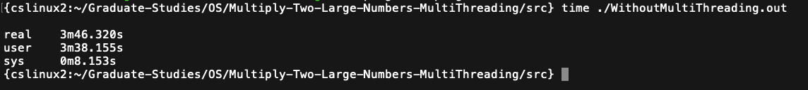
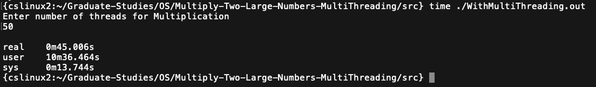

Project 2 :Operating Systems
---------------------------

Mulitplying Two Large Numbers

1) Using single thread prog1.cc
2) Using Multithreading prog2.cc

a.txt and b.txt contains two large number whose multiplication need to be computed. The computed value needs to be stored in c1.txt for Single thread Implementation and c2.txt for Multithread Implementation.

How to Compile and Run
----------------------
```shell
g++ prog1.cc -o WithoutMultiThreading.out -mcmodel=medium
./WithoutMultiThreading.out
```

```shell
g++ -pthread prog2.cc -o WithoutMultiThreading.out -mcmodel=medium
./WithMultiThreading.out
```

Performance Comparison
----------------------



